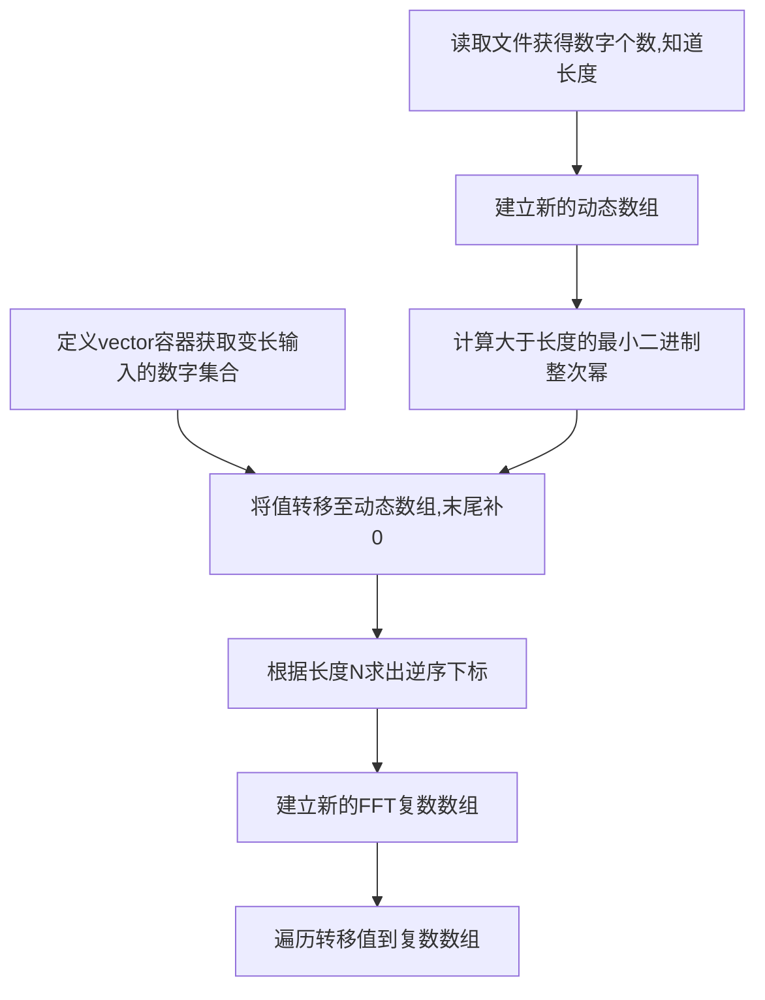

# 数学工具支持

该部分是编程语言需要提供的数学基础，并不涉及任何算法层面。

## 复数的数据类型

因为FFT计算针对的是复数，虽然输入一般都是**实信号**，但是在运算过程中都依赖于复数。

编程语言必须提供复数的数据类型，关于c++中实现复数的数据类型，有以下两种方案：

1. 自己使用结构体或者类构建一个复数类：

   复数由实部+虚部组成，构建起来并不复杂，只需要两个成员就可以表示一个复数，但是为了支持复数的基本运算，例如：

   > 求模运算，求幅角运算，相加运算，相乘运算，等等

   用类实现起来相对较为复杂，且可能功能会有缺陷，需要时间打磨。

2. 使用C++标准库实现：

   在C++中，标准库提供了构建复数的基本数据类型，只需要`#include <complex>`即可（没有`.h`）。

我选择的方案是使用C++提供的标准复数库来实现。

***


## 指数运算

因为DFT的公式中包含了单位根$W_N$,这涉及到指数运算，因为：
$$
W_N=e^{-j\frac{2\pi}{N}}
$$
而基于单位根的一系列操作，都需要C++提供类似`numpy.exp()`一样对指数的计算。

这里同样使用标准库`#include <cmath>`即可。

# 数据处理

C++貌似不支持中文输出打印，可执行程序会乱码。

## 数据读取

数据读取一般通过控制台终端进行输入，但是考虑到这里是复数，输入一个数据需要同时输入实部和虚部，并且还是很多组复数。

我们考虑使用文件的方式进行加载，即用户只需要按照**自己定的格式**编辑文本文件即可。

## 预处理

FFT需要数据预处理，面对的主要有以下几种情况：

1. 对于序列长度不足2的整数次幂的，需要先补足2的整数次幂。这一点DFT不需要，FFT由于分治计算的特性需要。
1. 对序列进行倒位序排序，这是FFT计算的需求，DFT的话不需要。

### 序列补全

补全的思路是采用一种自动搜索**比当前数大的最小的二的整数次幂的算法**。

原理是借助了**任意进制中进制数的整数次幂的数只有一个1的性质**。

补全的C++代码如下：

```c++
uint32_t FindMinBin(uint32_t num)
{
    //判断num本身是否就是2的整数次幂
    if((num & (num - 1)) == 0)
    {
        return num;
    }
    //如果不是则开始迭代
    uint32_t top = 0x8000000;
    while (!(top & num))    
    {
        top = top >> 1;
    }
    top = top << 1;
    return top;
}
```

基于该算法可以找到那个比当前数大的最小的二的整数次幂数，知晓了序列应有的FFT计算长度，就可以直接申请一个动态数组。

***

1. [找到比某个数大的最小的2的次幂_求大于m的2的最小次幂_YZF_Kevin的博客-CSDN博客](https://blog.csdn.net/yzf279533105/article/details/119456350#:~:text=找到比某个数大的,的次幂数就是64)

### 倒位排序

这里的倒位排序并不是指将正序的数组逆序排布，而是一种独特的倒位方法。倒位指的是：

> 将二进制数的高位（一定是有效位1）与低位进行互换位置。

这个时候根据二进制数的位数会出现两种情况：

- 二进制位数为奇数：中间一个数不动，两边依次进行对调。
- 二进制位为偶数：以对称轴两边数进行对调。

至于为什么需要**倒位这个操作**？是因为FFT原本的计算思路频域是乱序的，为了让频域正序，因此从时域开始就令倒序。

比较经典的倒序算法是**雷德算法**。不过这里我认为：

> 已知点数N，则其N点序列的倒位序下标可以唯一确定。


## 数据结构

存储序列数据所选择的结构可以是C++数组（指针），也可以是STL的vector。

两种序列结构各有各自的优势：

- `vector`:提供了很多运算，并且容量不限制。
- 数组：访问速度非常快，但最致命的缺陷是容量需要实现指定。

这里我选择的方案是**数组**，为了克服数组所面临的问题，我采用了**动态数组**的方式，数组可以分为：

- 栈数组：静态数组，内存大小事先指定。
- 堆数组：动态申请分配内存，可以在程序运行的过程中指定内存容量。因为从堆空间申请，因此称为**堆数组**

本项目全部基于堆数组实现，但是前面提到了补齐的问题，这个问题也可以解决：



整个预处理的流程如上图所示。

***

1. [c++数组和 vector访问执行性能比较_vector和数组的效率-CSDN博客](https://blog.csdn.net/h799710/article/details/107544792)
2. [【C++】细说C++中的数组之动态数组_c++ 动态数组-CSDN博客](https://blog.csdn.net/u013921430/article/details/79601429)

# 算法实现（重复计算）

FFT算法已经相对于DFT来说减少了很多计算步骤，但针对FFT本身来说，某一级的单位根可能都是一样的值，利用这一点，我们可以避免重复计算多次一样的单位根。

***

1. [用C++实现FFT - 知乎 (zhihu.com)](https://zhuanlan.zhihu.com/p/573678235)

# 算法实现（未重复计算）

FFT算法的实现方案有**递归型**和**非递归型**，而递归和非递归的算法之间是可以相互转换的。本项目我采用非递归型。

## 算法流程

FFT的计算图由很多级组成，而每一级都有最基本的蝶形运算单元组成。FFT的算法流程图如下图所示：


算法总共可以分为**三层循环**：

- 最外层循环：假设FFT一共有$M$级，则需要循环$M$次，完成每一级的蝶形计算：
  - 第二层循环：计算一共需要$J$次蝶形单位根计算，然后循环$J$次，遍历每个蝶形单元的单位根计算。
    - 第三层循环：从实际的数组开始遍历，利用之前算好的单位根

## 算法思想

FFT由很多的蝶形计算单元组成，蝶形计算单元的公式如下：
$$
X[k]=X_1[k]+W_N^k\cdot X_2[k]\\
X[k+\frac{N}{2}]=X_1[k]-W_N^k\cdot X_2[k]
$$
以$N=16$点FFT为例，FFT的计算图如下图所示：


假设总共有$M=log_2{(N)}$级，则：


这里的间数其实就是指的是**一个蝶形计算单元中的两个输入之间的下标间隔**，注意是倒位序之后的，比如$x(0)$和$x(8)$的间隔其实就是$2^0=1$，因为经过倒位序之后，$x(8)$变到了第二位。

***

算法有如下注意事项：

- 每一级的蝶形计算的次数必定为$\frac{N}{2}$次，但FFT不一定，因为FFT避免了重复计算。
- 一个蝶形单元只享有一个单位根。

***

1. [C语言系列之FFT算法实现 - 知乎 (zhihu.com)](https://zhuanlan.zhihu.com/p/135259438)

# 算法实现（递归）

递归其实更加贴近**课本上推导FFT**的过程，首先就是针对一个DFT序列将其划分为奇数和偶数序列部分：


FFT的思想是每次都把序列分为奇序列与偶序列。

***

1. [快速傅里叶变换算法原理简述 基于递归的fft实现_fft的分段递归算法-CSDN博客](https://blog.csdn.net/a493823882/article/details/78731540)

# 蝶形图绘制

基-2时间的FFT和基2-频率的FFT的蝶形计算图是不一样的：

- 基2-时间的FFT：必须进行倒位序算法，保证频域顺序的一致性。
- 基2-频率的FFT：不用进行倒位序算法。

1. [FFT推导之蝶形计算图推导_fft蝶形运算流程图-CSDN博客](https://blog.csdn.net/u013071075/article/details/108259341)